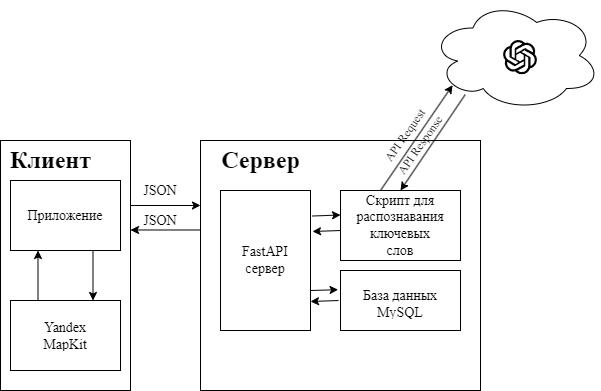
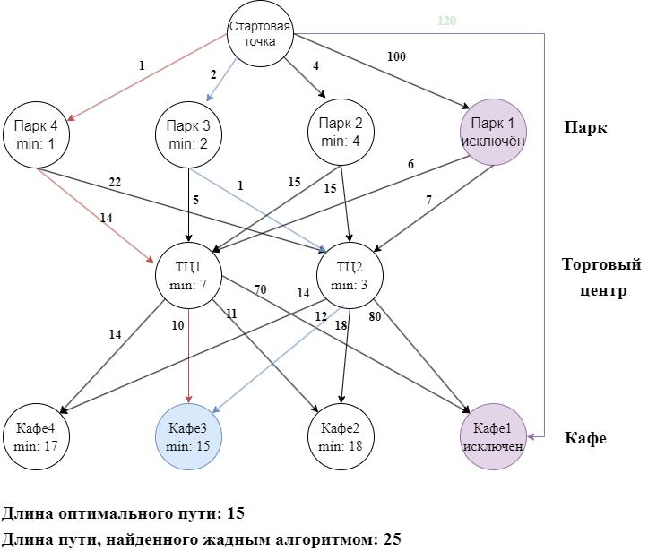

# GoTripMap
 
Приложение по построению маршрута прогулки/поездки на карте по голосовому/текстовому запросу пользователя. Выполнено в рамках ВКР. Работа над приложением была завершена в июне 2024 года, небольшие поправки были внесены позже.

 ## Описание работы
Данная работа посвящена созданию мобильного приложения GoTripMap, позволяющего пользователю построить маршрут по своему запросу. Запросы пользователя могут содержать множество пунктов назначения. Эти запросы могут не содержать адреса пункта назначения или его названия – пользователю достаточно указать тип места, которое он хочет посетить. Кроме того, пользователь может указать требования ко времени, за которое он хочет добраться до точки назначения, и транспорт, который он хочет использовать. 
В ходе работы были написаны бэкенд и фронтенд приложения. Для приложения был написан алгоритм, позволяющий найти кратчайший маршрут, удовлетворяющий требованиям пользователя. Удалось создать требуемое приложение, оптимизировать его и проверить его работу.

В результате работы были изучены возможности OpenAI и библиотеки natasha для анализа запросов пользователя, Yandex MapKit для построения маршрутов, Jetpack Compose для создания графического интерфейса. Задача поиска нужного маршрута была сведена к задаче поиска минимального пути в направленном ациклическом графе, вершины которого отсортированы в топологическом порядке.

## Cхема работы приложения
Приложение построено по клиент-серверной архитектуре. На стороне сервера находится база данных и FastAPI сервер. FastAPI сервер предоставляет API для взаимодействия пользователя с различными скриптами. Одни скрипты отвечают за распознавание ключевых слов в запросе, которое осуществляется путём взаимодействия с API EdenAI (который в свою очередь использует OpenAI) и обработки текста с помощью библиотеки natasha. Другие скрипты отвечают за регистрацию пользователей и синхронизацию данных путём взаимодействия с базой данных.

Клиент представляет собой Android-приложение, которое отвечает за взаимодействие с сервером и отображение графического интерфейса. Библиотека Yandex MapKit используется для поиска промежуточных точек, соответствующих ключевым словам из запроса, и получения данных о маршруте между ними.
 
 
## Алгоритм поиска кратчайшего маршрута
Алгоритм работает следующим образом:

1.  В качестве начальной точки используется начальное положение пользователя.
    
2.  Осуществляется поиск точек, которые соответствуют местам из списка мест, которые хочет посетить пользователь. Для этого вызывается метод submit у класса-наследника Session.SearchListener. В результате получается список списков точек, в котором сначала идёт список точек, соответствующих первому месту из запроса пользователя, затем список точек, соответствующих второму месту из запроса пользователя, и так далее до последнего места из запроса.
    
3.  Первый маршрут ищется с помощью жадного алгоритма. Яндекс.Карты сортируют результаты поиска по некоему рангу (принципы, по которым этот ранг формируется, неясны из документации). В качестве промежуточных точек для первого маршрута используются точки, которые заняли первые места в результатах поиска. Таким образом пользователь получает маршрут, проходящий через места, получившие наивысшую оценку от алгоритмов Яндекса.
    
4.  Второй маршрут – кратчайший возможный. Для понимания работы алгоритма построения кратчайшего маршрута лучше представить возможные маршруты в виде ациклического направленного графа.
5. В качестве начального приближения используется маршрут, построенный с помощью жадного алгоритма, минимизирующего расстояние до следующей точки на каждом этапе работы. Если для определённого места указано временное ограничение, то жадный алгоритм, дойдя до поиска точки, соответствующей этому месту, ищет точку, продолжительность пути до которой наиболее точно соответствует заданному ограничению. Маршрут, построенный жадным алгоритмом, изображён красными стрелками на рисунке ниже.
    
6.  После этого анализируется расстояние от начальной точки до всех найденных точек. Из графа убираются точки, расстояние до которых больше, чем длина маршрута, найденного жадным алгоритмом – очевидно, что оптимальный маршрут не проходит через них. Исключённые точки выделены серым на рисунке.
    
7.  Кратчайший путь в ациклическом направленном графе, вершины которого отсортированы в топологическом порядке, можно найти за линейное время, обходя вершины графа по порядку и вычисляя минимальные расстояния до них.
    
8.  В случае, если пользователь указал какие-либо временные ограничения для определённого места, то для каждого узла графа, соответствующего этому месту, ищется такой путь, чтобы его продолжительность максимально близко соответствовала заданным ограничениям. Узлы, продолжительность маршрута до которых слишком велика, исключаются. Оптимальный маршрут выделен синим цветом.
 

 ## Наша команда

 ###  Бельская София

 Tech Lead, Team Lead, Tech Autor

 

### Здир Дениc

Android Developer, Backend Developer

 ### Киселев Георгий

 ML Developer

 

 ### Горяинов Дмитрий

 Backend Arhitecture Developer

 
